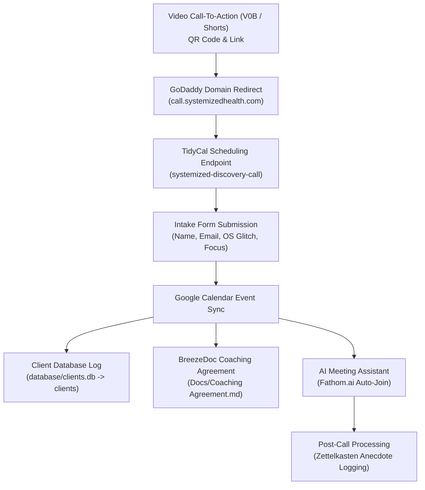

# 80.06 — Client Onboarding & Discovery Call SOP

This document defines the operational standards, technical flow, intake protocols, and automation verification for onboarding prospective clients into Systemized Health via the **Free 20-Minute Systemized Discovery Call**.

---

## 1. Onboarding Funnel Architecture

---

## 2. Step-by-Step SOP Specifications

### Step 1: Traffic Redirect & Short URL Tracking
- **Domain Endpoint**: `http://call.systemizedhealth.com/` (managed on GoDaddy).
- **Target URL**: `https://tidycal.com/craigandersondc/systemized-discovery-call`
- **Redirect Policy**: 301 Permanent Redirect (HTTPS enforced).
- **Tracking Standard**: Append URL parameters in descriptions and QR codes:
  - `?utm_source=youtube&utm_medium=video&utm_campaign=V0B`
- **Verification Rule**: Verify redirect resolves in under 2 seconds on mobile and desktop browsers.

---

### Step 2: TidyCal Intake & Data Collection
- **Platform**: TidyCal (EXT-05).
- **Appointment Type**: Free 20-Minute Systemized Discovery Call.
- **Required Fields**:
  1. **Full Name** (Required)
  2. **Email Address** (Required)
- **Recommended Custom Intake Questions**:
  3. **Primary Health Glitch / Friction Point**: *"What is the main physical or energy bottleneck holding you back right now?"* (Text field).
  4. **Systemized OS Focus Level**: *"Which level do you feel needs immediate attention?"*
     - Level 1: Foundational Baseline (Fuel, Move, Rest)
     - Level 2: Internal Processing (Think, Learn, Connect)
     - Level 3: External Execution (Play, Organize, Purpose)
     - Not Sure / General Discovery
- **Verification Rule**: Test booking workflow monthly and verify email confirmation receipt.

---

### Step 3: Google Calendar Integration
- **Sync Protocol**: TidyCal automatically creates calendar event on Dr. Anderson's Google Calendar.
- **Event Location / Link**: Google Meet URL automatically generated and attached to invite.
- **Notification Schedule**:
  - Email confirmation upon booking.
  - Email reminder 24 hours prior to scheduled call time.
  - Email reminder 1 hour prior to scheduled call time.

---

### Step 4: Coaching Agreement Workflow (Google Forms / BreezeDoc)
- **Document Source**: [`docs/Coaching Agreement.md`](file:///Users/craiganderson/Developer/SystemizedHealth/docs/Coaching%20Agreement.md)
- **Active Agreement Form URL**: [Google Forms Discovery Call Agreement](https://docs.google.com/forms/d/e/1FAIpQLScOmaeooaLLHFBppRqDI4Mtb9uM8qnU9eUH0gjo0HFU_NqGzQ/viewform?usp=header)
- **TidyCal Integration**: TidyCal booking confirmation page redirects to this Google Form URL.
- **Delivery Protocol**:
  - **Discovery Call Stage**: Client is automatically redirected to the Google Form agreement upon TidyCal booking completion.
  - **Formal Coaching Stage**: When client converts to formal coaching program, send comprehensive e-signature agreement link directly via email.
- **Verification Rule**: Verify form submissions periodically and log agreement status in client database.

---

### Step 5: AI Meeting Assistant & Post-Call Pattern Mining
- **Platform**: Fathom.ai (EXT-04).
- **Auto-Join Policy**: Fathom bot automatically joins scheduled Google Calendar discovery call links.
- **Post-Call Protocol**:
  1. Fathom generates transcript, AI summary, and action items upon call completion.
  2. Technical Editor / AI inspects transcript for patient friction points and clinical anecdotes.
  3. Extracted anecdotes and pattern insights are logged under `ZETTELKASTEN` proposition nodes in Workflowy or SQLite database (`database/videos.db`).
- **Client DB Logging**: Record booking and call completion status in `clients` / `discovery_calls` table in local database ([`database/clients.db`](file:///Users/craiganderson/Developer/SystemizedHealth/database/clients.db)).

---

### Step 6: Client Web Application Provisioning & Subscriber Platform
- **Scope**: Dedicated web application for active coaching clients and subscribers.
- **Prototype Reference**: Testing active implementation with `HollyApp` in external repository (`/Users/craiganderson/Developer/HollyApp`).
- **Functionality**:
  1. Personal client portal / dashboard for tracking Level 1–3 Systemized OS metrics (Fuel, Move, Rest, TLC, Execution).
  2. Direct sync with Supabase client records (`coaching_sessions`, `coaching_notes`).
  3. Custom subscriber portal for ongoing habit tracking and coaching content.
- **Workflow**:
  - Upon converting a client to the Coaching Intensive, clone/instantiate client web app environment.
  - Link client ID and credentials in `database/clients.db` / Supabase `clients` table.

---

## 3. Operations Checklist (Pre-Launch Verification)

| Item | Step | Description | Status |
| :--- | :--- | :--- | :--- |
| **01** | **Step 1** | Verify `call.systemizedhealth.com` GoDaddy redirect resolves to TidyCal. | ✅ **Verified** |
| **02** | **Step 2** | Verify TidyCal booking availability & intake form fields. | ✅ **Verified** |
| **03** | **Step 3** | Verify Google Calendar sync & Google Meet link generation. | ✅ **Verified** |
| **04** | **Step 4** | Setup Discovery Call Agreement Google Form & TidyCal redirect. | ✅ **Verified** |
| **05** | **Step 5** | Verify Fathom.ai Google Calendar auto-join integration. | 🔄 **In Progress** |
| **06** | **Database** | Create `clients` and `discovery_calls` tables in `database/clients.db` & sync TidyCal. | ✅ **Verified** |
| **07** | **Step 6** | Provision client-specific webapp portal for coaching clients & subscribers. | 🔄 **Testing (HollyApp)** |
