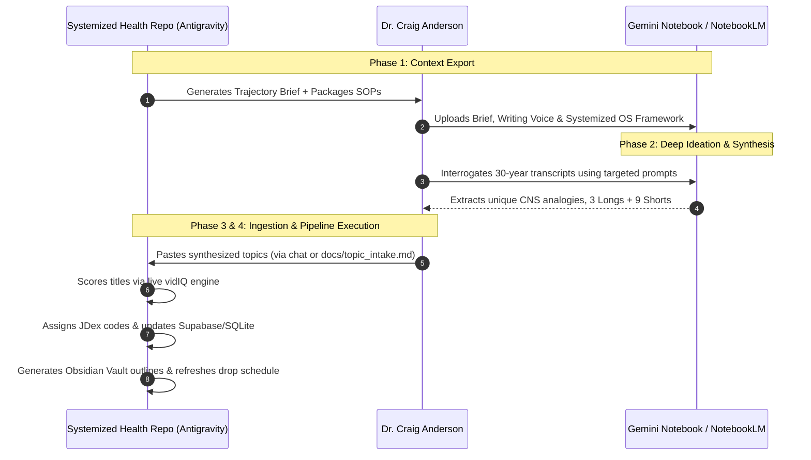

# 80.07 — Gemini Notebook Topic Planning SOP

This standard operating procedure defines the two-way bridge between the **Systemized Health codebase/database** (Antigravity IDE) and Dr. Craig Anderson's **Gemini Notebook / NotebookLM** research repository (lecture transcripts, clinical class notes, and CNS archives).

---

## 1. Why We Bridge the Two Workspaces

| Workspace | Role & Contents | Strength |
| :--- | :--- | :--- |
| **Gemini Notebook (Private Cloud)** | 30+ years of clinical notes, chiropractic seminar transcripts, CNS lectures, patient case studies, and raw neurological teaching analogies. | **Deep ideation & synthesis**: Uncovers Dr. Anderson's authentic analogies and clinical framing directly from his lifetime archive of work. |
| **Systemized Health Repo (Local IDE)** | Supabase database, production pipeline (`video_pipeline.py`), vidIQ MCP analytics engine, Johnny Decimal Vault, and teleprompter scripts. | **Execution & engineering**: Title CTR scoring, metadata tracking, waterfall scheduling, and teleprompter script assembly. |

---

## 2. The 4-Phase Bridge Protocol



---

## 3. Phase 1: Outbound Context Export (Repo → Notebook)

Dr. Anderson uploads or copies the following core context files into his Google Drive / Gemini Notebook as sources:

1. **[`docs/CNS_Topic_Trajectory_Brief.md`](file:///Users/craiganderson/Developer/SystemizedHealth/docs/CNS_Topic_Trajectory_Brief.md)** — The active briefing document containing target dates, structural requirements (3 Longs + 9 Waterfall Shorts), and targeted exploration prompts.
2. **[`SOPs/Systemized OS Framework.md`](file:///Users/craiganderson/Developer/SystemizedHealth/SOPs/Systemized%20OS%20Framework.md)** — The architectural hierarchy (Level 1 FMR, Level 2 TLC, Level 3 POP).
3. **[`SOPs/Writing Voice.md`](file:///Users/craiganderson/Developer/SystemizedHealth/SOPs/Writing%20Voice.md)** — Dr. Anderson's authentic text DNA and conversational pacing.
4. **[`SOPs/Writing Guidance.md`](file:///Users/craiganderson/Developer/SystemizedHealth/SOPs/Writing%20Guidance.md)** — Guardrails stripping out generic AI jargon.

*(Tip: If you keep a Google Doc in your Drive for the Trajectory Brief, you can simply paste the contents of `docs/CNS_Topic_Trajectory_Brief.md` into it, and NotebookLM can sync directly from that Doc).*

---

## 4. Phase 2: In-Notebook Synthesis Workflow

Inside Gemini Notebook, Dr. Anderson runs targeted queries against his combined sources (his uploaded class archives + repo brief):

1. **Extract Unique Analogies**:
   > *"Review my class transcripts and clinical notes. What specific analogies do I use to explain the autonomic switchboard, sympathetic tone, and stress? Pull out the metaphors that resonate most with patients."*
2. **Bridge Neurology to Daily Life / Organization**:
   > *"How do my lectures link executive function, mental fatigue, and personal organization to brainstem and autonomic physiology? Summarize my core principles on how structure creates neurological freedom."*
3. **Draft the 3-Week Trajectory**:
   > *"Propose 3 long-form video themes and 3 waterfall shorts for each (9 shorts total) that translate my central nervous system expertise into relatable, actionable health principles for an everyday audience."*

---

## 5. Phase 3: Inbound Ingestion (Notebook → Repo)

Once the topics are refined in Gemini Notebook, Dr. Anderson brings the results back to the repo using either:
- **Direct Chat Input**: Pasting the refined output into the Antigravity conversation.
- **Intake File**: Dropping the text directly into `docs/topic_intake.md`.

### Required Intake Structure:
```markdown
### Week 1
- **Long Video**: [Working Title] — [Core Neurological Mechanism & Analogy]
- **Short 1**: [Glitch/Hook & Tactical Patch]
- **Short 2**: [Glitch/Hook & Tactical Patch]
- **Short 3**: [Glitch/Hook & Tactical Patch]

(Repeat for Weeks 2 and 3)
```

---

## 6. Phase 4: Production Pipeline Execution (Repo Automation)

Upon receiving the intake from Dr. Anderson, the Agent immediately executes the following pipeline sequence:

1. **Title Optimization & vidIQ Scoring**:
   - Executes `python3 scripts/vidiq_sync.py --score-title "[Title]"` for all proposed long and short titles.
   - Generates high-CTR title variations (target score: 85–100) adhering strictly to `SOPs/Writing Guidance.md`.
2. **Knowledge Taxonomy & Metadata Mapping**:
   - Maps each video to its appropriate Johnny Decimal code in `Obsidian_Vault/JDex/` (e.g., `82 – Neurology`, `42.04 Stress, Anxiety & Depression`, `81.05 Lifestyle Management`).
   - Assigns official video codes (e.g., `80.V1C2`, `80.V1C2-S1` through `-S3`).
3. **Database Seeding**:
   - Updates Supabase and SQLite via `scripts/video_pipeline.py`, updating titles, format types, drop dates, and transitioning status from placeholder to `#write`.
4. **Vault Generation**:
   - Creates new Stage 1 outline files in `Obsidian_Vault/Zettlekasten/[Code] Script - [Title].md` with full YAML metadata and rough outline blocks.
5. **System Refresh**:
   - Executes `python3 scripts/video_pipeline.py --cache` to sync `Drop_Schedule.md`, `publication_calendar.ics`, and `docs/video_pipeline_cache.json`.
