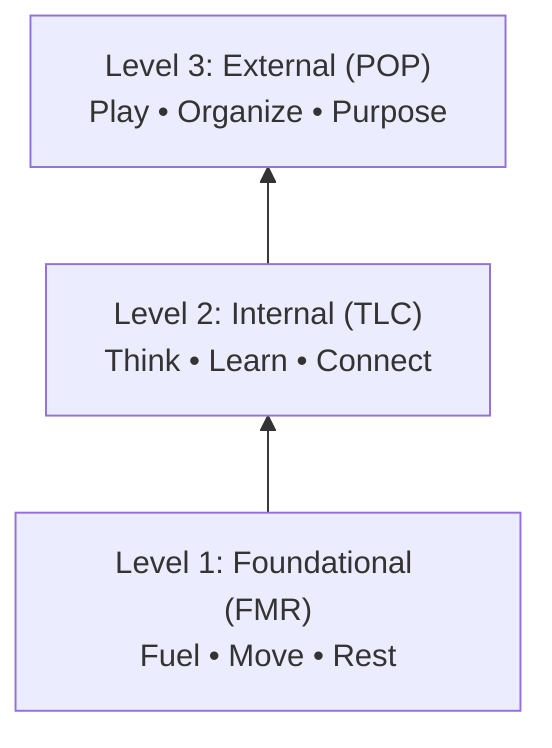

# 80.11 The Systemized Health Operating System (OS)

## 1. Brand and Product Positioning

The channel operates under the brand **Systemized Health**. The core messaging delivered to the audience is the **Systemized Operating System (OS)**.

The content targets the general public and everyday individuals looking to bring order to chaotic physical and mental states. The messaging removes the burden of willpower and moral failure. Viewers are taught habits that require little effort and can run as a background operating system. When health fails, it is a system glitch requiring a structured update, not a lack of discipline.

### Core Vocabulary & Positioning Tropes
* **Background OS**: Low-effort, low-friction habits that run automatically without draining willpower.
* **System Glitch**: Health failures and fatigue framed as software errors requiring structured updates, not moral failure.
* **Clinician / Systems Engineer**: The creator persona guiding the viewer through a biological software installation.
* **Patch Notes**: Micro-habit updates or short-form actionable tweaks.

---

## 2. The Three-Tiered Architecture

The Systemized OS is built on a strict biological hierarchy. Content must always contextualize where a specific topic sits within this three-level structure. A viewer cannot successfully execute a higher level if the lower levels are unstable.

### Overview Table

| Level | Tier Name | Acronym | Pillars | Core Purpose |
| :--- | :--- | :--- | :--- | :--- |
| **Level 1** | **Foundational** | **FMR** | Fuel • Move • Rest | Secures physical requirements for life; stops biological bleeding |
| **Level 2** | **Internal** | **TLC** | Think • Learn • Connect | Mental capacity & emotional calibration (requires physical stability) |
| **Level 3** | **External** | **POP** | Play • Organize • Purpose | Outer world engagement & environment (requires L1 stability & L2 clarity) |

---

### Level 1: Foundational (FMR)
*Stands for Fuel, Move, Rest.* This level secures the physical requirements for life and stops the biological bleeding.
* **Fuel and Energy**: Nutrition, hydration, metabolic baseline.
* **Move and Activity**: Physical movement, daily activity, mobility.
* **Rest and Recover**: Sleep architecture, nervous system down-regulation, recovery.

### Level 2: Internal (TLC)
*Stands for Think, Learn, Connect.* This level develops mental capacity and emotional calibration. It is only addressed after physical stability is established.
* **Think and Process**: Cognitive clarity, emotional processing, stress calibration.
* **Learn and Challenge**: Intellectual growth, skill acquisition, cognitive stimulation.
* **Connect**: Relational health, social connection, emotional resonance.

### Level 3: External (POP)
*Stands for Play, Organize, Purpose.* This level covers engagement with the outer world and environmental interaction. It requires the stability of Level 1 and the processing clarity of Level 2.
* **Play**: Joy, experimentation, creative expression.
* **Organize and Goal Setting**: Systems creation, workflow management, strategic goal execution.
* **Purpose and Planning**: Long-term vision, life alignment, actionable planning.

---

## 3. Narrative Continuity and Strategy

Every video must explicitly tie back to the **Systemized OS**. The creator acts as the clinician guiding the viewer through a biological software installation. For long-term content planning, we will generally start at the Foundational level and move up the tiers from there.

### The Hub-and-Spoke Retention Engine
When discussing a Level 3 topic (such as goal setting), the script must remind the viewer that execution is impossible without a stable Level 1 baseline. This hub-and-spoke method cross-pollinates the audience across different pillars and drives binge-watching behavior.

### Visual Production Notes
Visual graphics should be used to map this structure on screen (e.g., displaying the 3-Tier OS diagram whenever positioning a topic within the hierarchy).
