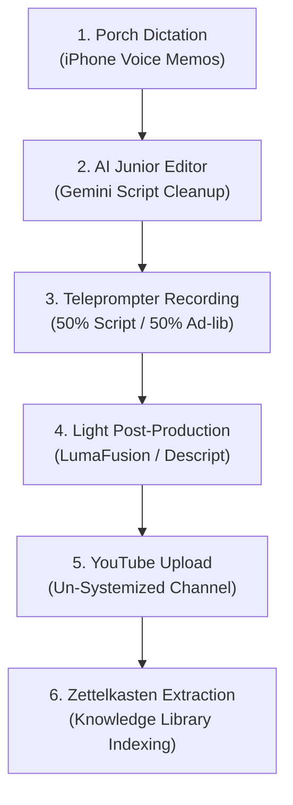

# Un-Systemized Video SOP

**Created:** 2026-08-03  
**Author:** Dr. Craig Anderson  
**Purpose:** Standard Operating Procedure for producing behind-the-scenes content for the off-to-the-side *Un-Systemized* channel.

---

## 1. Overview & Purpose

The *Un-Systemized* channel is a dedicated behind-the-scenes laboratory for Dr. Craig Anderson. It serves as an unvarnished space to:
- Get camera reps and test video production gear (DJI Osmo 3, DJI Lapel Mics, LumaFusion, Descript).
- Document daily progress and workflow experiments for archival and personal improvement.
- Explore deep-dive creator topics: Zettelkasten knowledge management, personal information systems, and practical life workflows.
- Serve as a rough draft board for ideas without cluttering the main channel.

---

## 2. Mandatory Pipeline Isolation Rule

> [!CAUTION]
> **STRICT ISOLATION PROTOCOL**: *Un-Systemized* is an independent, off-to-the-side channel. It must NEVER be mixed with the main *Systemized Health* pipeline.
> 
> 1. **Do NOT add Un-Systemized videos to Supabase** (the `videos` table).
> 2. **Do NOT run pipeline sync tools** (e.g., `python3 scripts/video_pipeline.py`) on Un-Systemized content.
> 3. **Do NOT record Un-Systemized content in `database/clients.db`** or `docs/video_pipeline_cache.json`.
> 4. **Do NOT cross-promote** or link the main channel from Un-Systemized videos to preserve algorithm and audience separation.

---

## 3. Directory Structure & File Naming Conventions

All *Un-Systemized* files are stored in the root `Un-Systemized/` directory inside this repository.

### File Naming Format:
- **Audio Draft File**: `Un-Systemized/[Code] - Audio Draft.txt`  
  *(Raw unedited voice dictation transcript)*
- **Teleprompter Script File**: `Un-Systemized/[Code]A - Script.txt`  
  *(Cleaned teleprompter script for recording)*

*Example for Episode 1:*
- Audio Draft: `Un-Systemized/32.40.1 - Audio Draft.txt`
- Teleprompter Script: `Un-Systemized/32.40.1A - Script.txt`

---

## 4. End-to-End Production Workflow

### Step 1: Porch Dictation (Audio Draft)
1. Sit in a comfortable, relaxed setting (e.g., on the porch with coffee and dog).
2. Open iPhone Voice Memos and record raw, unscripted spoken thoughts on the video topic.
3. Export the raw audio transcript into `Un-Systemized/[Code] - Audio Draft.txt`.

### Step 2: AI Junior Editor (Teleprompter Script Generation)
1. Input the raw audio draft into Gemini.
2. Provide the standard directive:  
   *"Organize this transcript in my own words. Trim ramblings, cut boring parts, and format into a clean teleprompter script. Do not write creative content or change my voice—act strictly as my junior editor."*
3. Verify the output against `SOPs/Writing Guidance.md` (no AI filler, no banned words).
4. Save the final teleprompter script as `Un-Systemized/[Code]A - Script.txt`.

### Step 3: Teleprompter Recording
1. Load `Un-Systemized/[Code]A - Script.txt` into the iPhone teleprompter app mounted on the Osmo 3 camera.
2. Record using the **50/50 Hybrid Model**: read ~50% of the dictated cues from the teleprompter, and fill in the remaining ~50% with natural spoken ad-libbing.

### Step 4: Light Post-Production
1. Long-form videos: Stitch footage and perform light audio polishing in LumaFusion. (No heavy graphics or transcript overlays required).
2. Short-form clips: Use Descript for quick transcript-based edits if needed.

### Step 5: YouTube Publishing
1. Upload directly to the **Un-Systemized** YouTube channel.
2. Add basic tags and titles without over-optimizing for the main channel's funnel.

### Step 6: Zettelkasten Librarian Extraction
1. Post-recording, treat the video transcript as the **authoritative asset**.
2. Review the transcript, identify key insights ("nuggets"), and index them into the permanent Zettelkasten knowledge system (physical cards + digital notes).

---

## 5. Channel Comparison Reference

| Parameter | Systemized Health (Main) | Un-Systemized (Side Channel) |
| :--- | :--- | :--- |
| **Audience** | 40-50 year olds seeking health solutions | Creators, builders, technical note-takers |
| **Core Topics** | Health OS, 3-tier framework, chiropractic | Zettelkasten, PKM, workflows, behind-the-scenes |
| **Call to Action** | Free Discovery Call (`call.systemizedhealth.com`) | None / Informal creator connection |
| **Database & Pipeline** | Logged in Supabase, DB, and `TODO.md` | Isolated in `Un-Systemized/` directory only |
| **Commitment** | 3-year push (1 long + 3 shorts/week) | Flexible / Relaunch behind-the-scenes lab |
