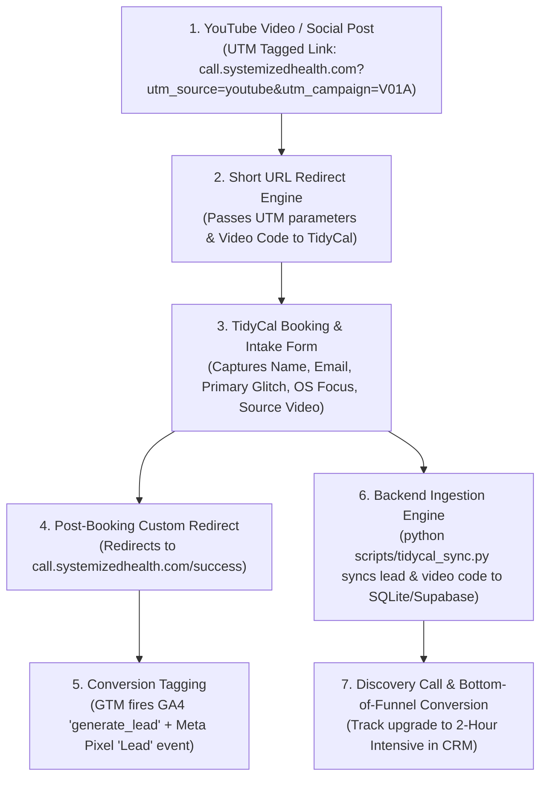

# Systemized Health: YouTube to Systemized Discovery Call Marketing Funnel

## 1. Funnel Architecture & Strategic Objectives
* **Campaign Objective**: Drive engaged YouTube viewers to book a free 20-minute Systemized Discovery Call, serving as the front-end lead generator for the paid 2-hour Systemized Health Coaching Intensive.
* **Primary Call to Action (CTA)**: `call.systemizedhealth.com`
* **Target Endpoint**: Resolves to `https://tidycal.com/craigandersondc/systemized-discovery-call`
* **Standard CTA Copy Format**: 
  > *"Book your free 20-minute Systemized Discovery Call: call.systemizedhealth.com"*
* **Target Conversion**: Completed booking on TidyCal.
* **Secondary Conversion**: Upgrade from 20-minute free discovery call to paid 2-hour Intensive.

---

## 2. Technology & Tracking Stack
| Technology | Role | Implementation / Configuration |
|---|---|---|
| **Short Link / Domain** | Short URL & Attribution Entrypoint | `call.systemizedhealth.com` (redirects to TidyCal) |
| **Scheduling Engine** | Booking & Intake Collection | TidyCal (`https://tidycal.com/craigandersondc/systemized-discovery-call`) |
| **Tag Manager** | Event Dispatch & Script Hosting | Google Tag Manager (GTM) |
| **Analytics Engine** | Web Analytics & Conversion Funnel | Google Analytics 4 (GA4) |
| **Ad Tracking Pixels** | Paid Acquisition & Remarketing | Meta (Facebook/Instagram) Pixel + Google Ads |
| **CRM / Database** | Client Profile & Lifecycle Tracking | SQLite (`database/clients.db`) & Supabase CRM |
| **Automation Sync** | Automated Ingestion & Attribution | Python Sync Engine (`scripts/tidycal_sync.py`) |

---

## 3. Step-by-Step Operational Funnel & Attribution Architecture



### Detailed Phase Breakdown

| Step | Phase | User / System Action | Tracking Mechanism | Data Location |
|---|---|---|---|---|
| **1** | **Video Launch CTA** | Viewer clicks link in video description, pinned comment, or cards. | Standardized UTM Parameters attached to short URL:<br/>`http://call.systemizedhealth.com/?utm_source=youtube&utm_medium=video&utm_campaign=VIDEO_CODE&utm_content=description` | YouTube Analytics & GA4 |
| **2** | **Redirection Engine** | Visitor lands on `call.systemizedhealth.com`. System preserves UTM parameters. | URL parameter forwarding / redirect engine. | DNS / Hosting Edge |
| **3** | **Booking & Intake** | Visitor selects time slot and completes TidyCal intake form (Name, Email, Primary Glitch, OS Focus). | TidyCal form submission + custom question for Video Code (`VIDEO_CODE`). | TidyCal DB |
| **4** | **Post-Booking Redirect** | TidyCal auto-redirects confirmed booker to custom confirmation URL. | Redirect URL: `https://call.systemizedhealth.com/success` | Browser Navigation |
| **5** | **Conversion Logging** | Confirmation page loads. | Google Tag Manager fires GA4 conversion event (`generate_lead` / `booked_call`) + Meta Pixel `Lead` event restricted to URL matching `/success`. | GA4 & Meta Ads Manager |
| **6** | **Automated CRM Sync** | `tidycal_sync.py` runs on session startup or cron schedule. | TidyCal REST API $\rightarrow$ `sync_booking_to_db()` extracts Name, Email, Intake Answers, and `source_video`. | SQLite (`database/clients.db`) & Supabase `clients` + `discovery_calls` tables |
| **7** | **Coaching Intensive Upgrade** | 20-min call conducted; client converted to paid 2-hour Intensive. | Status updated via `python scripts/crm.py` or Supabase. | Client CRM Profile |

---

## 4. Configuration Checklist & SOP

### A. YouTube Video CTA Placement Standard
- **In-Video Verbal CTA**: *"If you want to systemize your health, book your free 20-minute Systemized Discovery Call using the link in the description below."*
- **Description Copy (Line 1-2)**:
  ```text
  Book your free 20-minute Systemized Discovery Call: http://call.systemizedhealth.com/?utm_source=youtube&utm_medium=video&utm_campaign=VIDEO_CODE&utm_content=description
  ```
  *(Replace `VIDEO_CODE` with exact code from `docs/video_pipeline_cache.json`, e.g., `V01A`)*.

### B. TidyCal Configuration
1. Log into TidyCal $\rightarrow$ Select **Systemized Discovery Call (20 min)**.
2. Under **Intake Questions**, add:
   - *Primary Glitch / Bottleneck* (Text)
   - *OS Level Focus* (Text)
   - *Which video code or referral brought you here?* (Text / Hidden, e.g. `source_video`)
3. Under **Redirect after booking**, enable custom URL:
   - Target URL: `https://call.systemizedhealth.com/success`

### C. Google Tag Manager (GTM) & Meta Tracking Summary
1. Deploy master GTM Container snippets to the `<head>` and `<body>` of `call.systemizedhealth.com` and `/success`.
2. Configure GA4 Configuration Tag & Meta Base Pixel Tag on **All Pages**.
3. Configure GA4 Lead Event & Meta `Lead` Pixel Tag on **Page URL contains `/success`**.

### D. Automated CRM Ingestion Command
To manually execute or verify client synchronization at any time:
```bash
python3 scripts/tidycal_sync.py
```
This sync engine automatically writes lead profiles, discovery call appointments, and video source attributions directly into SQLite ([`database/clients.db`](file:///Users/craiganderson/Developer/SystemizedHealth/database/clients.db)) and Supabase CRM.

---

## 5. Multi-Platform Tracking Implementation (Meta Pixel & Google Tag Manager)

To track conversions across both **Meta (Facebook/Instagram Ads)** and **Google (Analytics 4 & Google Ads)**, deploy Google Tag Manager (GTM) on your landing domain (`call.systemizedhealth.com`) and success redirect (`/success`). GTM manages all tags cleanly in one centralized interface.

### A. Meta (Facebook) Pixel Setup Code
#### 1. Base Meta Pixel Script (Fire on All Pages)
Place inside GTM as a Custom HTML Tag firing on **All Pages**:
```html
<!-- Meta Pixel Code -->
<script>
!function(f,b,e,v,n,t,s)
{if(f.fbq)return;n=f.fbq=function(){n.callMethod?
n.callMethod.apply(n,arguments):n.queue.push(arguments)};
if(!f._fbq)f._fbq=n;n.push=n;n.loaded=!0;n.version='2.0';
n.queue=[];t=b.createElement(e);t.async=!0;
t.src=v;s=b.getElementsByTagName(e)[0];
s.parentNode.insertBefore(t,s)}(window, document,'script',
'https://connect.facebook.net/en_US/fbevents.js');
fbq('init', 'YOUR_PIXEL_ID'); // Replace YOUR_PIXEL_ID with your Facebook Pixel ID
fbq('track', 'PageView');
</script>
<noscript></noscript>
<!-- End Meta Pixel Code -->
```

#### 2. Meta Lead Event Conversion Tag (Fire on `/success` Page)
Place inside GTM as a Custom HTML Tag firing ONLY on trigger **Page URL contains `/success`**:
```html
<!-- Meta Lead Conversion Event -->
<script>
  fbq('track', 'Lead', {
    content_name: 'Systemized Discovery Call',
    content_category: 'Consultation Booking',
    value: 0.00,
    currency: 'USD'
  });
</script>
```

---

### B. Google Tag Manager (GTM) Container Code
Place the master GTM container scripts on `call.systemizedhealth.com` and `call.systemizedhealth.com/success`:

#### 1. Insert in `<head>` (Top of Head Tag)
```html
<!-- Google Tag Manager -->
<script>(function(w,d,s,l,i){w[l]=w[l]||[];w[l].push({'gtm.start':
new Date().getTime(),event:'gtm.js'});var f=d.getElementsByTagName(s)[0],
j=d.createElement(s),dl=l!='dataLayer'?'&l='+l:'';j.async=true;j.src=
'https://www.googletagmanager.com/gtm.js?id='+i+dl;f.parentNode.insertBefore(j,f);
})(window,document,'script','dataLayer','GTM-XXXXXXX');</script>
<!-- End Google Tag Manager -->
```
*(Replace `GTM-XXXXXXX` with your GTM Container ID)*

#### 2. Insert in `<body>` (Immediately After Opening Body Tag)
```html
<!-- Google Tag Manager (noscript) -->
<noscript><iframe src="https://www.googletagmanager.com/ns.html?id=GTM-XXXXXXX"
height="0" width="0" style="display:none;visibility:hidden"></iframe></noscript>
<!-- End Google Tag Manager (noscript) -->
```

---

### C. GTM Tag & Trigger Configuration Matrix

| Tag Name in GTM | Tag Type | Trigger | Configuration Details |
|---|---|---|---|
| **GA4 - Config Tag** | Google Tag / GA4 Configuration | All Pages | Measurement ID: `G-XXXXXXXXXX` |
| **GA4 - Event - Lead** | GA4 Event | Page URL contains `/success` | Event Name: `generate_lead`<br/>Parameter: `lead_type = discovery_call` |
| **Meta Pixel - Base** | Custom HTML | All Pages | Contains Base Pixel script with `fbq('init')` & `PageView` |
| **Meta Pixel - Lead** | Custom HTML | Page URL contains `/success` | Contains `fbq('track', 'Lead')` |
| **Google Ads - Conversion** | Google Ads Conversion Tracking | Page URL contains `/success` | Conversion ID: `AW-XXXXXXXXX`<br/>Conversion Label: `YYYYYYYYYY` |

---

### D. Verification SOP for Tracking Setup
1. **Meta Pixel Helper**: Install the Meta Pixel Helper Chrome Extension and visit `https://call.systemizedhealth.com/success` to verify the `Lead` event fires green.
2. **Tag Assistant**: Use [Google Tag Assistant](https://tagassistant.google.com/) (GTM Preview Mode) to confirm `generate_lead` fires when navigating to `/success`.
3. **GA4 Realtime**: Check GA4 Realtime dashboard under "Events" for `generate_lead` when a test booking redirects to `/success`.
